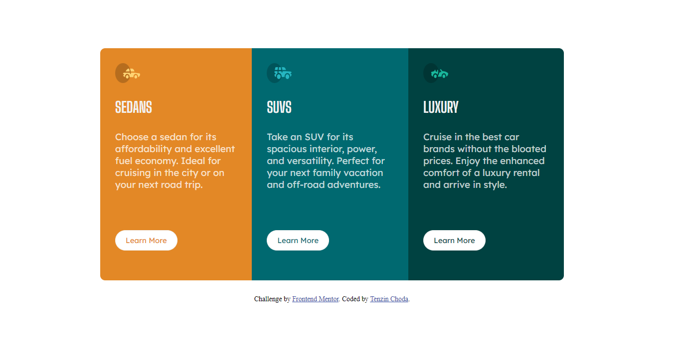

# Frontend Mentor - 3-column preview card component solution

This is a solution to the [3-column preview card component challenge on Frontend Mentor](https://www.frontendmentor.io/challenges/3column-preview-card-component-pH92eAR2-). Frontend Mentor challenges help you improve your coding skills by building realistic projects. 

## Table of contents

- [Overview](#overview)
  - [The challenge](#the-challenge)
  - [Screenshot](#screenshot)
  - [Links](#links)
- [My process](#my-process)
  - [Built with](#built-with)
  - [What I learned](#what-i-learned)
  - [Continued development](#continued-development)
  - [Useful resources](#useful-resources)
- [Author](#author)
- [Acknowledgments](#acknowledgments)

## Overview
This repository contains a 3 column preview card component designed with  *CSS flexbox*.

### The challenge

Users should be able to:

- View the optimal layout depending on their device's screen size
- See hover states for interactive elements

### Screenshot
# Mobile Design.

# Desktop Design.

### Links

- Solution URL: Check my solution on frontend mentor [here]()
- Live Site URL: checkout my live site [here](https://3-column-preview-card-component-tan.vercel.app/)

## My process
I have extensively used `CSS flexbox` for this design as I found it much easier than using grid for this design.

### Built with

- Semantic HTML5 markup
- CSS custom properties
- Flexbox
- Mobile-first workflow

### What I learned

# some of the things I learned:
- At first I wasn't able to apply `border-radius` on the `main` tag but then I later learned that using `over-flow: hidden;` hid the overflowing edges and the `border-radius` got applied.

## Author

- Frontend Mentor - [@tenze21](https://www.frontendmentor.io/profile/tenze21)
- Twitter - [@TenzinChoe17842](https://www.twitter.com/TenzinChoe17842)

## Acknowledgments
I am grateful to the frontend mentor team for this amazing challenge. It really helps alot.
